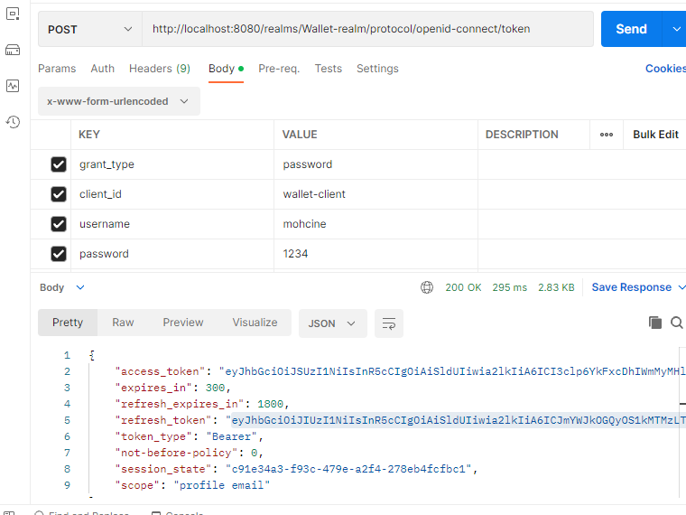

<h1>Activité pratique N° 4 : Sécurité des micro services avec Keycloak</h1>
<h3>1. Télécharger Keycloak 19</h3>
<h3>2. Démarrer Keycloak</h3>

<h3>3. Créer un compte Admin</h3>

<h3>4. Créer une Realm</h3>

<h3>5. Créer un client à sécuriser</h3>

<h3>6. Créer des utilisateurs</h3>

<h3>7. Créer des rôles</h3>

<h3>8. Affecter les rôles aux utilisateurs</h3>

<h3>9. Avec PostMan :</h3>
<h4>- Tester l'authentification avec le mot de passe</h4>
    
<h4>- Analyser les contenus des deux JWT Access Token et Refresh Token</h3>

<h4>- Tester l'authentification avec le Refresh Token</h4>
    
<h4>- Tester l'authentification avec Client ID et Client Secret</h4>
    

